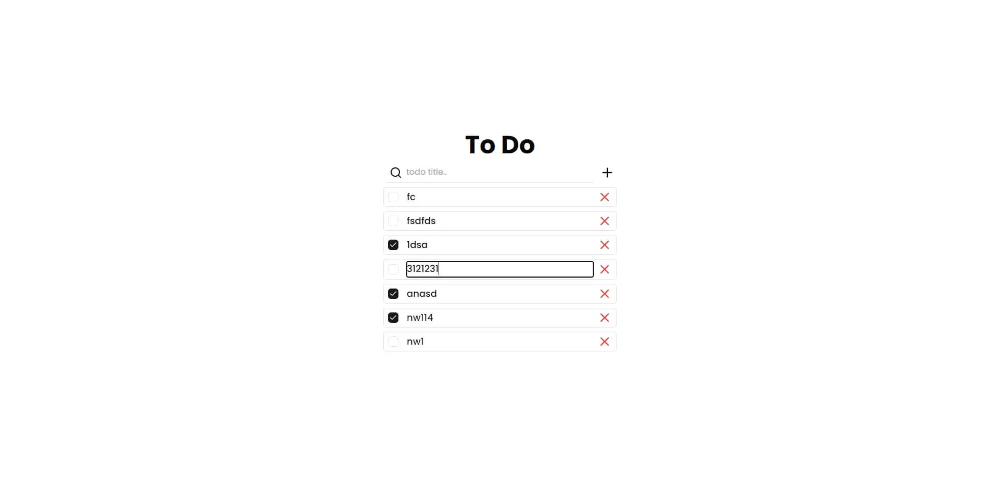

## Running Locally

1. Clone the repository

   ```bash
   git clone https://github.com/EDMIGHT/todo.git
   ```

2. Install dependencies to server folder **(relative to root)**

   ```bash
   cd server
   yarn
   ```

3. Copy the `.env.example` to `.env` and update the variables **(server folder)**.

   ```bash
   cp .env.example .env
   ```

4. Push the database schema **(server folder)**.

   ```bash
   yarn push
   ```

5. Start the development server **(server folder)**

   ```bash
   yarn dev
   ```

6. Install dependencies to client folder **(relative to root)**

   ```bash
   cd client
   yarn
   ```

7. Copy the `.env.example` to `.env` and update the variables **(client folder)**.

   ```bash
   cp .env.example .env
   ```

8. Start the development server **(client folder)**

   ```bash
   yarn dev
   ```
